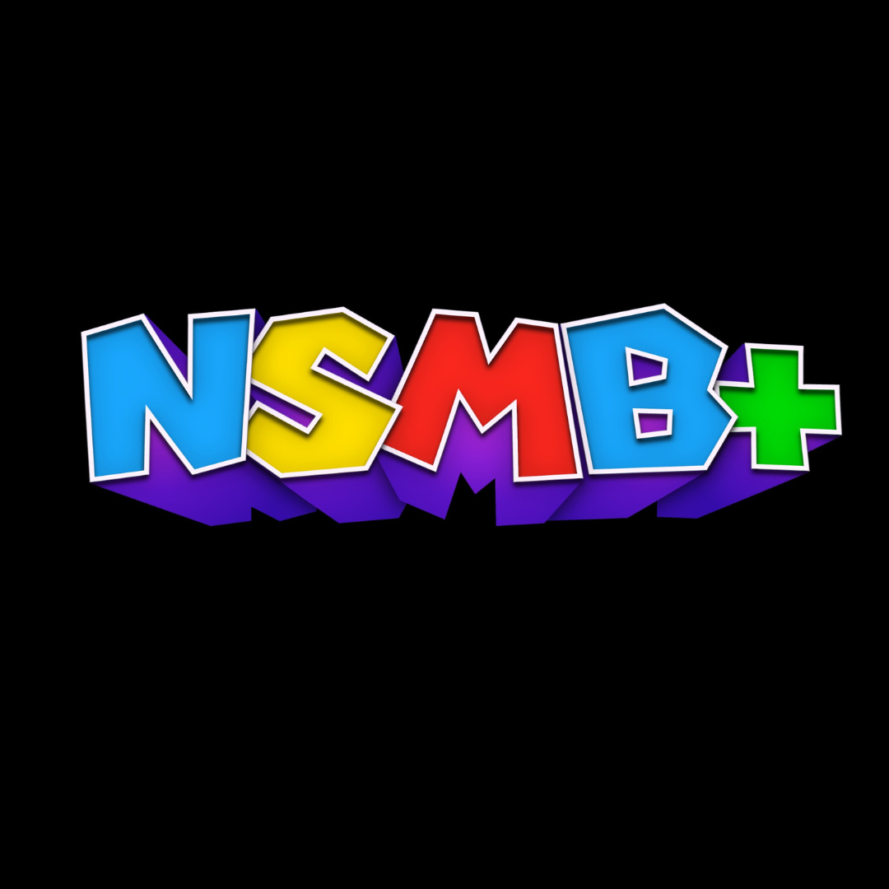

<div align="center">



# NSMB+

A quality-of-life ROM hack for New Super Mario Bros. DS.


</div>

---

## About
NSMB+ is a passion project aimed at improving the base game experience through small but meaningful changes. Built entirely using a custom Python toolset that interfaces directly with the game's binary files — no existing ROM hacking frameworks were used for the core modifications.

---

## Current Changes

| Area | Change |
|------|--------|
| Voice lines | DS sleep/wake voice lines now play Luigi's voice when Luigi is selected |
| Branding | Custom icon and title screen |

---

## Tools Built

| Script | Purpose |
|--------|---------|
| `nsmb.py` | Extracts all audio archives from any DS ROM |
| `convert.py` | Batch converts SWAR archives to WAV for listening |
| `swap.py` | Patches audio, icon and title data directly into the ROM |

---

## Requirements

- Python 3
- `ndspy`
- `Pillow`
- A legitimate copy of New Super Mario Bros. DS

## How to Use

```bash
pip3 install ndspy Pillow
python3 swap.py your_rom.nds NSMB+.nds
```

Then load `NSMB+.nds` in your emulator or flash it to a cartridge.

---

## Planned Updates
- [ ] Luigi-only voice lines triggered exclusively when Luigi is selected (requires ARM code patch)
- [ ] No-clip glitch on World 6, Castle 2
- [ ] Further quality of life improvements

---

<div align="center">

*Original intellectual property, the Mario Franchise and New Super Mario Bros. DS is solely owned by Nintendo. All rights reserved. No game files are included or distributed.*

</div>
